简体中文 | [English](./README.english.md)

# 目录
 * [一、Toolmaker是什么](#1)
 * [二、产品领先之处](#2)
 * [三、运行环境](#3)
 * [四、特性列表](#4)
 * [五、使用手册](#5)
 * [六、定制开发](#6)
 * [七、联系方式](#7)
 * [八、投资与募捐](#8)
 * [九、致谢](#9)

 ## <h2 id="1">一、Toolmaker是什么</h2>
 ### 1.1 Toolmaker是什么
  * Toolmaker是一款轻量级的软件开发生命周期管理SaaS平台，主要面向中小互联网软件企业及开发团队，是制造软件工具的工具。
  * Toolmaker依据软件工程理论开发，提供诸如产品管理、需求分析、系统设计、测试管理、缺陷跟踪、风险管理、任务管理等软件开发全流程功能，支持PC端、移动端显示。

 ### 1.2 解决的问题
  * 普遍缺乏符合软件工程定义的软件开发流程
  * 项目管理过程碎片化
  * 项目管理工具阶段化、多样化
  * 项目文档交付物杂乱
  * 经验与知识不能有效传承 

 ### 1.3 能够提供
  * 基于软件工程定义的开发流程
  * 连续统一的软件开发流程管理，从最初的原始需求收集到最后的产品维护终结
  * 摒弃各个阶段独立的管理工具，提供一站式平台操作
  * 不再需要各种格式的文档交付物，全部数据保存在平台中
  * SaaS软件，注册即可使用，无需安装和维护
  * 人性化、简洁的操作界面，使用一次即上手

 ### 1.4 适用范围
  * 中小互联网企业的软件开发流程管理
  * 大中小企业IT部门的软件开发流程管理

 ### 1.5 口号
  * Toolmaker不关注你开发什么，而关注你如何开发！
  * Toolmaker doesn't focus on what you develop，but on how you develop!

 ### 1.6 名字缘起
Toolmaker这个名字，受到电影《星球大战前传II--克隆人的进攻》一句台词的启发，其中一个情节是机器人C-3PO误入帝国的机器人士兵制造工厂，张口说道“Machines making machines. Huh! How perverse.” 是的，Toolmaker making (software) tools，Toolmaker是一个软件工具的制造者，缘起如是。

 ### 1.7 预览地址
  * 登录[https://toolmaker.io](https://toolmaker.io)，使用“产品演示”功能，会以guest用户登录，该用户可以查看一个演示产品“HR Management System”的所有内容，但不能创建任何内容。
  * 注册新用户，创建产品，开始一个新产品的软件开发过程。

 ### 1.8 宣传图片

 ## <h2 id="2">二、产品领先之处</h2>
 #### 2.1 思想领先
  * 对软件开发过程与方法的深刻理解
  * 基于完整统一的软件开发过程领域模型进行设计

 #### 2.2 技术领先
  * 前端采用Material Design设计风格，支持多端显示：PC，Laptop，iPad，iPhone，Android，支持PWA
  * 后端微服务架构运行于AWS云环境，使用Lambda Serverless、CloudFront、RDS等技术，自动扩展不断增加的业务量
 
 ## <h2 id="3">三、运行环境</h2>
  支持的终端类型：大屏幕，PC，笔记本，移动端Android，iPhone，iPAD
#### 3.1 Windows PC浏览器
  * 支持Chrome，Firefox，Edge, Opera, QQ, UC, 猎豹。不支持IE11及以下版本浏览器。

        
  * Edge浏览器会出现TLS协议的情况，需要修改，执行Settings->搜索"Internet Options"或者"Internet Properties"->Advanced->Security->勾选"Use TLS 1.0","Use TLS 1.1","Use TLS 1.2",见下图：

      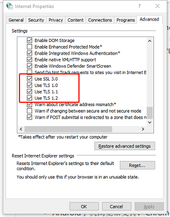 

#### 3.2 MacOS浏览器
  * 支持Safari
#### 3.3 移动端浏览器
  * Android手机浏览器支持：Chrome，Firefox，Edge，QQ, UC，微信内部浏览器。不支持Opera，猎豹浏览器。
  
  * iPhone手机浏览器：Safari
  * iPad浏览器：Safari
 
#### 3.4 PWA模式
  * 支持PWA模式，浏览器支持Chrome，Firefox，Edge。以Chrome浏览器为例：
      手机下载Chrome浏览器最新版本，打开https://toolmaker.io 网站，在浏览器操作菜单中主动选择“添加到主屏幕”，此时在手机屏幕生成一个APP图标，就可以转变为一个类似APP的应用,效果如最右图：

           
      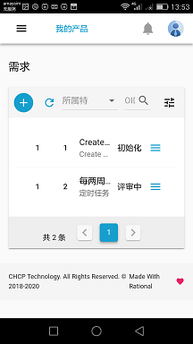

## <h2 id="4">四、特性列表</h2>
  ### 4.1 用户管理
  * 通过电子邮箱注册用户
  * 基于开发角色（产品经理/设计/开发/测试工程师）的权限管理
  ### 4.2 产品管理
  * 多产品管理，各个产品内容完全隔离，独立开发，互不干扰
  * 用户可以加入/退出产品，在加入的产品中切换，执行不同的开发角色和开发任务
  ### 4.3 特性管理
  * 基于产品重要特性的分类管理，是后期需求分析和系统设计的统一基础
  ### 4.4 需求管理
  * 基于UseCase的需求写作模板，特性-需求-测试用例跟踪列表
  ### 4.5 组件设计
  * 系统架构组件设计与描述
  ### 4.6 功能设计
  * 模块功能设计与描述
  ### 4.7 在线UML设计
  * 支持PlantUML在线设计，支持4+1模型，支持10种UML图
  ### 4.8 RESTful接口展示功能
  
  ### 4.9 测试用例管理
  * 对应每一个需求编写测试用例，复用UseCase分析结果
  ### 4.10 缺陷跟踪
  * 完整的缺陷处理流程，在开发和测试之间无碍流转
  ### 4.11 风险管理
  * 基于预防措施和应急计划的风险管理，风险发生后自动生成任务处理
  ### 4.12 任务管理
  * Todo List任务管理，拖拽改变任务状态，操作简单
  ### 4.13 自定义文档
  * 可以自己定义书写任意格式，内容的文档。
  ### 4.14 评论，操作记录，附件上载
  * 每一个特性，需求，缺陷等资源都支持多人评论，操作记录显示，上载附件。

 ## <h2 id="5">五、使用手册</h2>
  ### 5.1 用户注册与登录
  * 填写Email进行注册。使用邮箱进行验证，点击获取验证码，系统会把注册验证码发送到用户填写的邮箱中。用户登录邮箱获取验证码，填写用户名称、验证码和密码后进行注册;
  * 注册成功后，用户即可以登录使用系统。

  ### 5.2 创建新产品
  * 用户第一次登录系统后，根据提示进行创建产品，创建完成后点击切换至该产品，即可以邀请成员，开始创建特性和需求；
  * “个人版本”一个用户最多可以创建1个产品；

    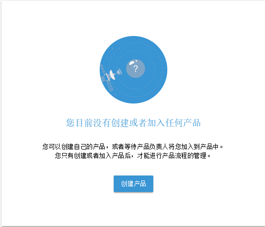

  * 在任何时刻，用户可以点击顶部菜单“我的产品”进行查看目前加入的产品，或者创建新的产品。

    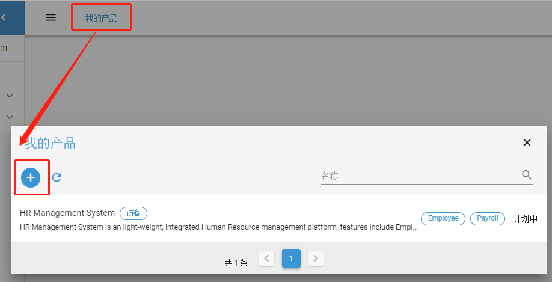

  ### 5.3 邀请用户加入产品
  * 产品创建后，只有产品经理（默认为产品创建者）才能邀请其他用户加入产品：点击左侧菜单->设置->成员，一次可以增加多个成员，并分配相应的角色。“个人版本”一个产品最多可以邀请包括产品经理在内5个成员。

    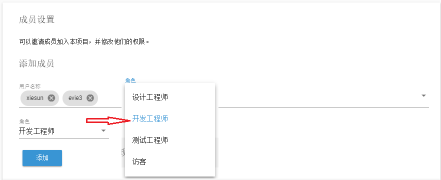

  * 产品经理可以修改现有成员的角色，或者可以移除某个成员，同时移除该成员在产品内的所有权限。如果是非产品经理角色的成员登录系统，则可以在这个界面主动退出某个产品。

    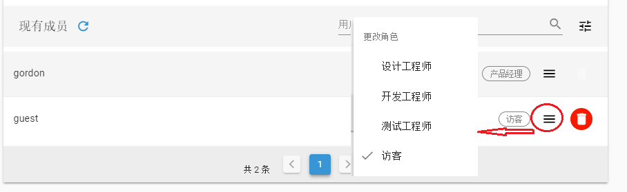

  ### 5.4 角色权限定义
  目前定义四种角色，分别是：
  * 产品经理（ProductManager）：权限包括创建产品与产品管理，邀请成员与成员管理，创建特性与特性管理，创建需求与需求管理，测试管理等所有权限；
  * 设计工程师（DesignEngineer）：权限包括创建产品，创建特性与特性管理，创建需求与需求管理，任务管理，测试管理等；
  * 开发工程师（DevelopEngineer）：权限包括创建产品，任务，风险，缺陷；
  * 测试工程师（TestEngineer）：权限包括创建产品，任务，风险，测试用例，缺陷；
  * 访客（Guest）：能读取产品所有数据，可以创建产品，可以修改用户资料，但不能修改和新建其他资源。

  ### 5.5 特性管理
  只有产品经理和设计工程师才有权限创建和管理特性。“个人版本”每个产品最多可以创建20个特性。
  #### 5.5.1 创建特性
  点击左侧菜单->需求管理->特性，打开特性列表，点击列表上方的“+”号，填写名称，简介，分类，重要性，可获得性，客户价值，特性增强，依赖关系等选项进行创建；可以自定义Tag进行标识；
    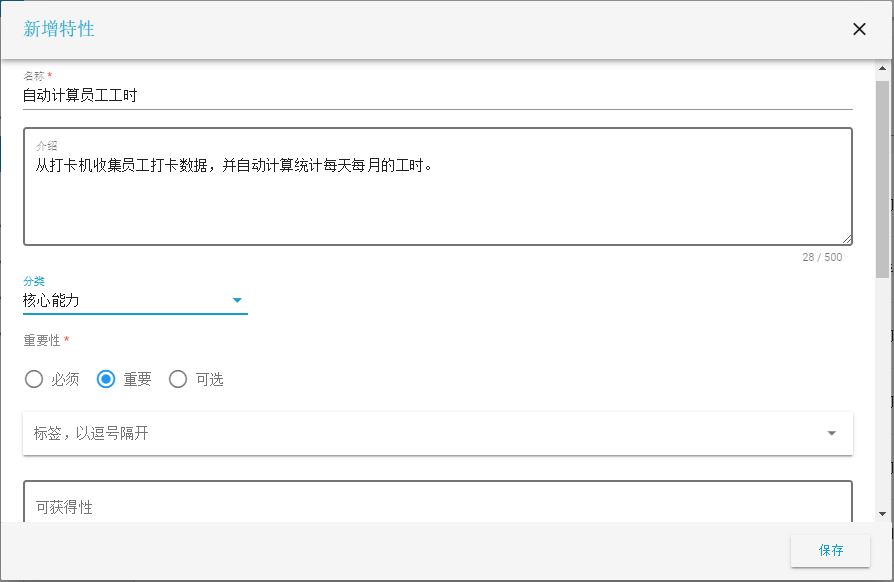

  #### 5.5.2 特性列表
  * 每列数据从左到右依次是：特性编码OID，名称，自定义Tag，重要性，状态，操作菜单。

    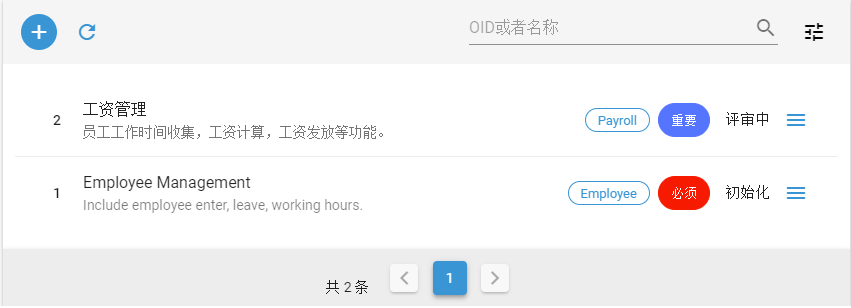

  * 可以按照OID和特性名称查询
  * 可以按照最近修改日期，最近创建日期，特性名称排序
  * 可以按照状态过滤。特性状态有：初始化，开发中，已冻结，已结束。

    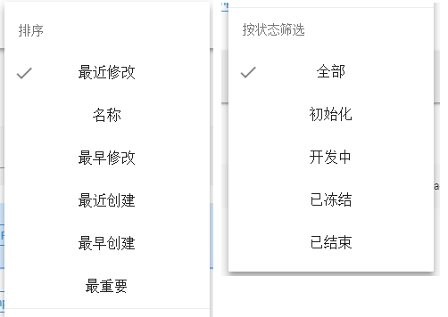

  #### 5.5.3 特性操作
  * 编辑特性
  * 复制特性
  * 冻结/恢复特性
  * 删除特性。只有处于初始状态的特性才可以删除，删除的特性不能被恢复
  * 查询该特性下的需求列表
  * 对特性进行评论，查看评论
  * 查询特性的操作记录
  * 上载附件

    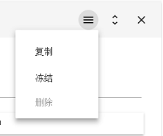
    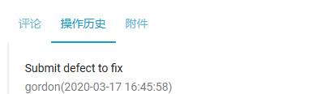

  ### 5.6 需求管理
  只有产品经理和设计工程师才有权限创建和管理需求。“个人版本”每个特性最多可以创建30个需求。
  #### 5.6.1 创建需求
  点击左侧菜单->需求管理->需求，打开需求列表，点击列表上方的“+”号，填写名称，简介，分类，重要性等内容进行创建；可以自定义Tag进行标识；
  如果需求分类选择了“功能需求”，则需求按照UseCase格式进行描述，输入角色，触发条件，前置条件，后置条件，处理过程，分支流程等内容；如果分类选择了“非功能需求”，则按照一般格式进行描述。
      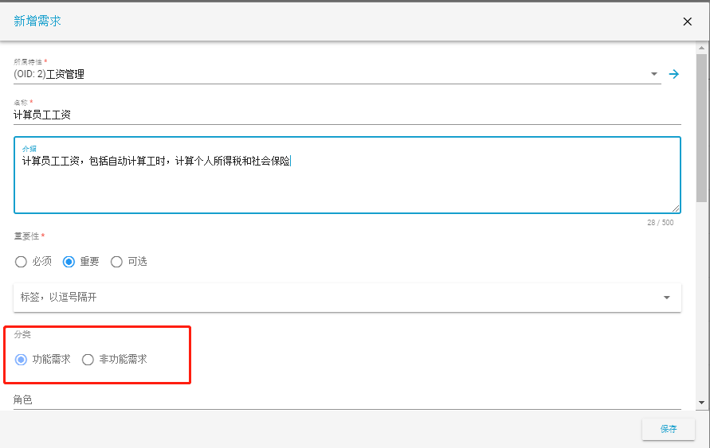

  #### 5.6.2 需求列表
  * 每列数据从左到右依次是：需求编码OID，名称，自定义Tag，重要性，状态，操作菜单。
  * 可以按照OID和需求名称查询
  * 可以按照最近修改日期，最近创建日期，需求名称排序
  * 可以按照状态过滤。需求状态有：初始化，开发中，已冻结，已结束。

    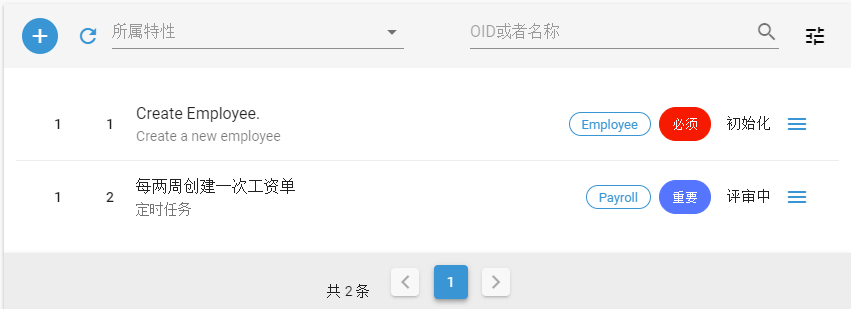

  #### 5.6.3 需求操作
  * 编辑需求
  * 复制需求
  * 冻结/恢复需求
  * 删除需求。只有处于初始状态的需求才可以删除，删除的需求不能被恢复
  * 查询该需求对应的特性信息，完成特性到需求的跟踪
  * 创建开发任务。可以把需求转化为任务，一个需求只能创建一个任务
  * 对需求进行评论，查看评论
  * 查询需求的操作记录
  * 上载附件

  ### 5.7 组件设计
  只有产品经理和设计工程师才有权限创建和管理组件。“个人版本”每个产品最多可以创建20个组件。
  #### 5.7.1 创建组件
  点击左侧菜单->设计管理->组件，打开组件列表，点击列表上方的“+”号，填写名称，简介，描述等内容进行创建；可以自定义Tag进行标识；

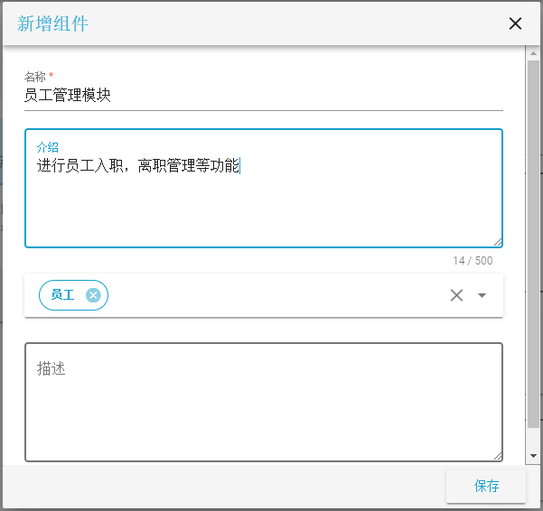

  #### 5.7.2 组件列表
  * 每列数据从左到右依次是：组件编码OID，名称，自定义Tag，操作菜单。
  * 可以按照OID和需求名称查询
  * 可以按照最近修改日期，最近创建日期，组件名称排序

    

  #### 5.7.3 组件操作
  * 编辑组件
  * 复制组件
  * 删除组件。删除的组件不能被恢复。

  ### 5.8 功能设计
  只有产品经理和设计工程师才有权限创建和管理功能。“个人版本”每个产品最多可以创建200个功能。
  #### 5.8.1 创建功能
  点击左侧菜单->设计管理->功能，打开功能列表，点击列表上方的“+”号，填写所属组件，名称，简介，功能输入，功能处理，功能输出等内容进行创建；可以自定义Tag进行标识；
      

  #### 5.8.2 功能列表
  * 每列数据从左到右依次是：功能编码OID，名称，自定义Tag，操作菜单。
  * 可以按照OID和需求名称查询
  * 可以按照最近修改日期，最近创建日期，功能名称排序

    

  #### 5.8.3 功能操作
  * 编辑功能
  * 复制功能
  * 删除功能。删除的功能不能被恢复。
  * 创建开发任务。可以把功能转化为任务，一个功能只能创建一个任务

  ### 5.9 在线UML
  只有产品经理和设计工程师才有权限创建和管理UML。“个人版本”每个产品最多可以创建50个UML图。

  通过4+1模型来管理整个系统的UML图；执行PlantUML脚本格式，支持生成多达10种UML图。
  #### 5.9.1 创建UML图
  点击左侧菜单->设计管理->UML，打开UML列表，点击列表上方的“+”号，填写所属分类，名称，在PlantUML编辑框输入UML定义脚本，然后执行“刷新”，系统会调用PlantUML服务器生成UML图。
    可以拖动缩放按钮进行图片的放大或缩小。
    点击保存按钮，保存编辑的UML脚本。
      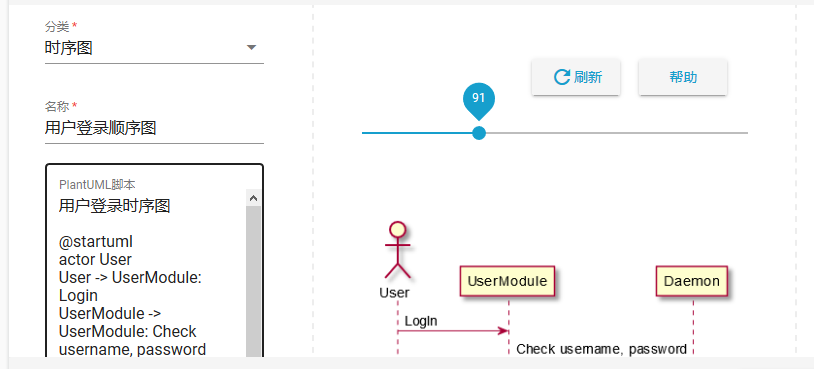

  #### 5.9.2 UML列表
  * 每列数据从左到右依次是：名称，自定义Tag，操作菜单；
  * 可以按照UML图名称查询；
  * 可以按照最近修改日期，最近创建日期，名称排序

    

  #### 5.9.3 功能操作
  * 编辑UML
  * 复制UML
  * 删除UML。删除的UML不能被恢复。

  ### 5.10 RESTful接口
  目前只提供Swagger格式的RESTful接口上载和显示功能，可以上载多个接口文件显示。
    

  ### 5.11 测试用例管理
  只有产品经理和测试工程师才有权限创建和管理测试用例。“个人版本”每个需求最多可以创建10个测试用例。
  #### 5.11.1 创建测试用例
  点击左侧菜单->测试管理->测试用例，打开测试用例列表，点击列表上方的“+”号，填写所属需求，名称，重要性，前置条件，输入数据，处理过程，期望结果等内容进行创建；可以自定义Tag进行标识；
      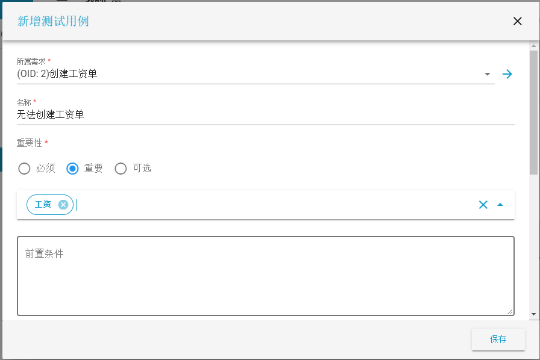

  #### 5.11.2 测试用例列表
  * 每列数据从左到右依次是：测试用例编码OID，名称，自定义Tag，重要性，测试结果（注：非状态），操作菜单。
  * 可以按照OID和测试用例名称查询
  * 可以按照最近修改日期，最近创建日期，测试用例名称，重要程度排序
  * 可以按照测试结果过滤。测试结果取值有：未测试，通过，失败，阻塞。

    

  #### 5.11.3 测试用例操作
  * 编辑测试用例
  * 复制测试用例
  * 删除测试用例。只有初始化的测试用例才可以被删除，删除的测试用例不能被恢复
  * 对测试用例进行评论，查看评论
  * 查询测试用例的操作记录
  * 上载附件

  ### 5.12 缺陷跟踪
  任何角色的用户都可以创建和提交缺陷。“个人版本”每个产品最多可以创建500个缺陷。
  #### 5.12.1 创建缺陷
  点击左侧菜单->测试管理->缺陷，打开缺陷列表，点击列表上方的“+”号，填写所属模块，名称，重要性，产品版本，测试环境，复现条件，问题现象等内容进行创建；可以自定义Tag进行标识；
      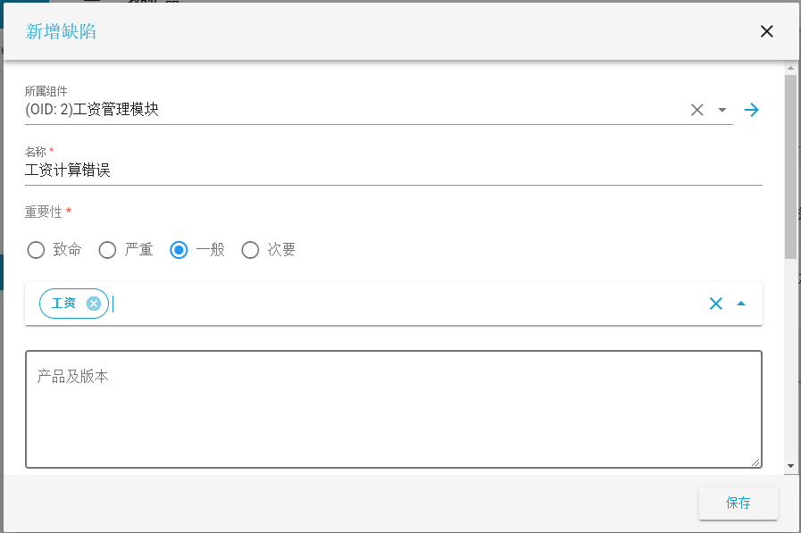

  #### 5.12.2 缺陷列表
  * 每列数据从左到右依次是：缺陷编码OID，名称，自定义Tag，重要性，状态，操作菜单。
  * 可以按照OID和测试用例名称查询
  * 可以按照最近修改日期，最近创建日期，测试用例名称，重要程度排序
  * 可以按照状态过滤，缺陷定义的状态有：初始化，修改中，测试中，已关闭。
        

  #### 5.12.3 缺陷操作
  * 编辑缺陷
  * 复制缺陷
  * 删除缺陷。只有初始化的缺陷才可以被删除，删除的缺陷不能被恢复。
  * 对缺陷进行评论，查看评论
  * 查询缺陷的操作记录
  * 上载附件

  #### 5.12.4 缺陷处理
  处于不同状态的缺陷有不同的操作：
  * 初始化: 可以提交缺陷给开发人员，也可以直接关闭缺陷；
  * 修改中：修改完成后可以提交给测试人员进行测试，或者转给其他开发人员，也可以直接拒绝这个缺陷；
  * 测试中：测试人员完成测试后，可以关闭这个缺陷，或者回退给开发人员继续修改；
  * 已关闭：可以重新打开缺陷；
  

  ### 5.13 风险管理
  任何人都可以创建和管理风险。“个人版本”每个产品最多可以创建100个缺陷。
  #### 5.13.1 创建风险
  点击左侧菜单->任务管理->风险，打开风险列表，点击列表上方的“+”号，填写名称，介绍，风险几率，影响程度（会自动计算风险指数），类型，选择一个责任人，计划的风险结束日期，填写避免措施，应急计划，备注等内容进行创建；可以自定义Tag进行标识；
      

  #### 5.13.2 风险列表
  * 每列数据从左到右依次是：风险编码OID，名称，自定义Tag，风险指数，状态，操作菜单。
  * 可以按照OID和风险名称查询
  * 可以按照最近修改日期，最近创建日期，风险名称，风险指数排序
  * 可以按照状态过滤，风险定义的状态有：未发生，已发生，已避免，已消失。
        

  #### 5.13.3 风险操作
  * 编辑风险
  * 复制风险
  * 删除风险。只有未发生的风险才可以被删除，删除的风险不能被恢复。
  * 创建开发任务。已经发生的风险系统会自动创建一个任务进行跟踪处理，一个风险只能创建一个任务
  * 对风险进行评论，查看评论
  * 查询风险的操作记录
  * 上载附件

  ### 5.14 任务管理
  任何人都可以创建和管理任务。“个人版本”每个产品最多可以创建500个任务。
  #### 5.14.1 创建任务
  点击左侧菜单->任务管理->任务，打开任务列表，点击列表上方的“+”号，填写名称，重要性，紧急程度（会自动计算优先级），选择一个责任人，计划的任务结束日期，任务描述等内容进行创建；可以自定义Tag进行标识；
      

  #### 5.14.2 任务列表
  * 任务列表缺省以Todolist视图显示，可以与普通列表视图切换。在Todolist视图下，可以拖动一个任务以改变其状态，任务容是任务编码OID，名称，责任人，优先级，计划结束日期；
        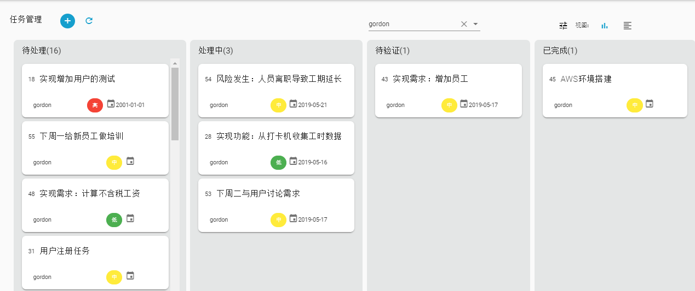

  * 普通列表每列数据从左到右依次是：任务编码OID，名称，自定义Tag，优先级，状态，操作菜单。
  * 可以按照OID和任务名称查询
  * 可以按照最近修改日期，最近创建日期，任务名称，优先级排序
  * 可以按照状态过滤，任务定义的状态有：待处理，处理中，待验证，已冻结，已完成。
      

  #### 5.14.3 任务操作
  * 编辑任务
  * 复制任务
  * 冻结任务
  * 删除任务。只有待处理的任务才可以被删除，删除的任务不能被恢复
  * 对任务进行评论，查看评论
  * 查询任务的操作记录
  * 上载附件

  ### 5.15 自定义文档
  任何人都可以创建和管理自定义文档。“个人版本”每个产品最多可以创建100个文档。
  #### 5.15.1 创建任务
  点击左侧菜单->文档，打开文档列表，点击列表上方的“+”号，填写名称，内容进行创建；
      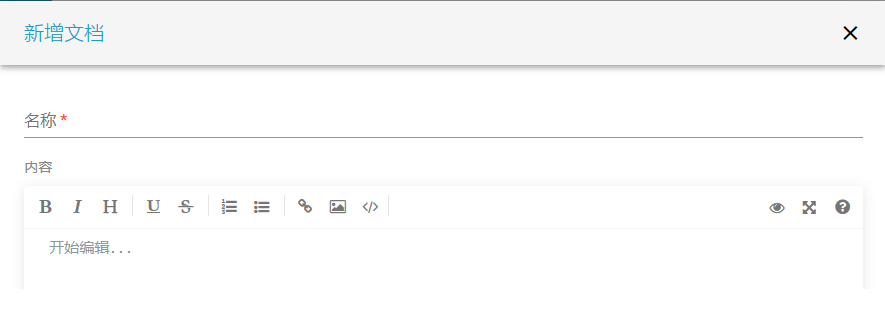

  #### 5.15.2 文档列表
  * 文档每列数据从左到右依次是：名称，操作菜单。
  * 可以按照名称查询
  * 可以按照最近修改日期，最近创建日期，名称排序

  #### 5.15.3 文档操作
  * 编辑文档
  * 复制文档
  * 删除文档
  * 对文档进行评论，查看评论
  * 查询文档的操作记录
  * 上载附件

  ### 5.16 产品设置
   * 只有产品经理才可以执行产品设置；
   * 点击左侧菜单->设置->产品，可以修改产品名称，描述，分类等信息。
   * 更换产品经理，选择一个产品成员进行更换。更换后，原来的产品经理将赋予开发工程师的角色，而新的产品经理将接替他执行管理产品的任务。

  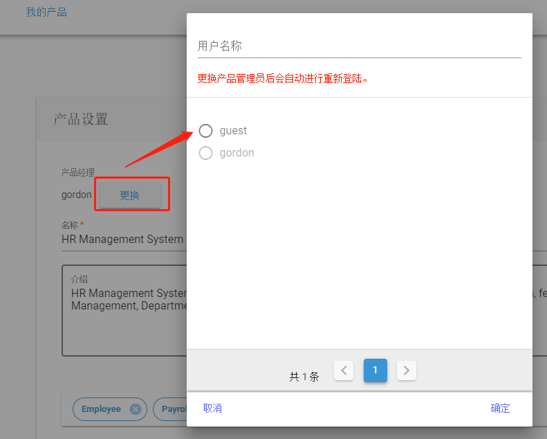

  * 删除产品。删除产品是非常谨慎的操作，在确认删除一个产品前，需要删除该产品特性和成员（产品经理无法自我删除），必须输入正确的产品名称后才能删除，删除后的产品无法恢复。

    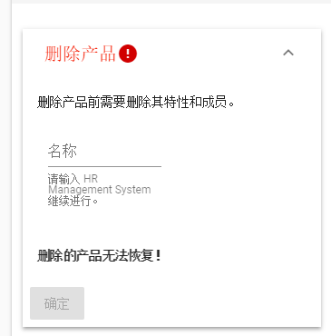

  ### 5.17 用户设置
  * 点击右上角菜单->设置，执行用户信息设置
  * 修改用户密码
  * 修改界面显示语言，目前支持简体中文和English两种语言。
  * 更换头像

    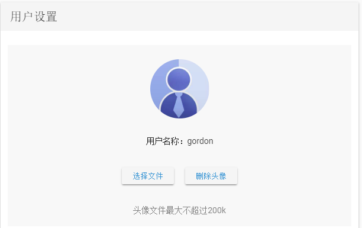

 ## <h2 id="6">六、定制开发</h2>
  * 我们可以在Toolmaker现有功能的基础上，为贵公司定制软件开发管理流程，以便更好的符合贵公司的业务流程。
  * 如果您看好我们的开发能力和开发质量，我们也愿意承接其他软件开发项目，请按照如下方式联系。

 ## <h2 id="7">七、联系方式</h2>
  * 重要事项请通过邮件联系：customerservice@toolmaker.com.cn；
  * 产品缺陷或新需求可以通过[Github Issues](https://github.com/CHCP/toolmaker-docs/issues)提出并获得解答；
  * 加入微信讨论群：请先加个人微信号（wxn1790343904），然后由管理员拉入微信讨论群，加入时请注明“Toolmaker”；
  * 加入QQ讨论群：150129626，加入时请注明“Toolmaker”；
  * 请关注我们的微信公众号：微信公众号搜索"CHCP"；或者扫描下方二维码关注：

    
 
 ## <h2 id="8">八、投资与捐款</h2>
  * 为了能使产品得到进一步的发展，我们寻找并接受风险投资，寻找更多更专业的人来开发运营这个产品，有意者请微信联系：wxn1790343904
  * 目前产品的“个人版本”是免费使用的，如果您觉得产品功能还不错，愿意支持我们，可以按照如下方式进行捐款，捐款所得款项将用来支付购买云计算费用，宣传广告，以及开发过程中的各种成本支出，我们非常感谢您的支持。
  
          
    
 ## <h2 id="9">九、致谢</h2>
  * 感谢团队开发成员，感谢他们对产品的热情付出和精湛的专业技能。
  * Toolmaker使用了不限以下技术，在此一并致谢：vue，vuetify，echarts，plantUML，mavon-editor，wwagger-ui，xormplus...
