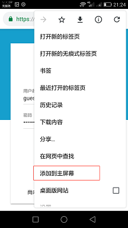
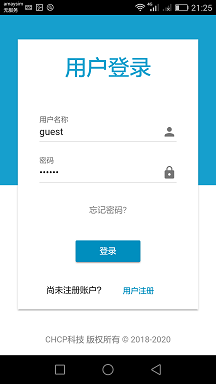

简体中文 | [English](./README.english.md)

# 目录
 * [一、Toolmaker是什么](#1)
 * [二、产品领先之处](#2)
 * [三、特性列表](#3)
 * [四、运行环境](#4)
 * [五、使用手册](#5)
 * [六、定制开发](#6)
 * [七、联系方式](#7)
 * [八、投资与募捐](#8)
 * [九、致谢](#9)

 ## <h2 id="1">一、Toolmaker是什么</h2>
 ### 1.1 Toolmaker是什么
  * Toolmaker是一款轻量级、基于web、集成式的软件生命周期管理（ALM）软件，涉及需求分析、系统设计、测试管理、缺陷跟踪、任务管理、风险管理等诸多特性，是对自己长达十几年在软件工程领域积累的工作经验的工具化探索，欢迎注册并使用。

 ### 1.2 解决的问题
  * 普遍缺乏符合软件工程定义的软件开发流程
  * 项目管理过程碎片化
  * 项目管理工具阶段化、多样化
  * 项目文档交付物杂乱
  * 经验与知识不能有效传承 

 ### 1.3 能够提供
  * 基于软件工程定义的开发流程
  * 连续统一的软件开发流程管理，从最初的原始需求收集到最后的产品维护终结
  * 摒弃各个阶段独立的管理工具，提供一站式平台操作
  * 不再需要各种格式的文档，全部数据保存在平台中
  * SaaS软件，注册既使用，无需安装和维护
  * 人性化、简洁的操作界面，使用一次既上手

 ### 1.4 适用范围
  * 中小互联网企业的软件开发流程管理
  * 大中小企业IT部门的软件开发流程管理

 ### 1.5 口号
  * Toolmaker不关注你开发什么，而是关注你如何开发。
  * Toolmaker don't care about what you do，but how you do.

 ### 1.6 名字缘起
Toolmaker这个名字，受到电影《星球大战前传II--克隆人的进攻》一句台词的启发，其中一个情节是机器人C-3PO误入帝国的机器人士兵制造工厂，张口说道“Machines making machines. Huh! How perverse.” 是的，Toolmaker making (software) tools，Toolmaker是一个软件工具的制造者，缘起如是。

 ### 1.7 预览地址
  * 登录[https://toolmaker.io](https://toolmaker.io)，使用“产品演示”功能，会以guest用户登录，该用户可以查看一个演示产品“HR Management System”的所有内容，但不能创建任何内容。
  * 注册新用户，创建产品，开始一个新产品的软件开发过程。

 ## <h2 id="2">二、产品领先之处</h2>
 #### 2.1 思想领先
  * 对软件开发过程与方法的深刻理解
  * 基于完整统一的软件开发过程领域模型进行设计

 #### 2.2 技术领先
  * 前端采用Material Design设计风格，支持多端显示：PC，Laptop，iPad，iPhone，Android，支持PWA
  * 后端微服务架构运行于AWS云环境，使用Lambda Serverless、CloudFront、RDS等技术，自动扩展不断增加的业务量

 ## <h2 id="3">三、特性列表</h2>
  ### 3.1 产品管理（已上线）
  * 多产品管理，用户可以创建多个产品，各个产品内容完全隔离，独立开发，互不干扰
  * 用户可以加入/退出产品，在加入的产品中切换，执行不同的开发角色和开发任务
  ### 3.2 用户管理（已上线）
  * 注册用户
  * 基于开发角色（产品经理/设计/开发/测试工程师）的权限管理
  ### 3.3 原始需求管理
  ### 3.4 特性管理（已上线）
  * 创建特性
  * 复制冻结恢复特性
  ### 3.5 需求管理（已上线）
  * 创建需求
  * 复制冻结恢复需求
  * 特性-需求跟踪
  ### 3.6 设计管理
  ### 3.7 测试管理
  ### 3.8 任务管理
  ### 3.9 项目管理

 ## <h2 id="4">四、运行环境</h2>
  * 浏览器：支持Chrome，Firefox，Safari 10+，Edge，IE 11
       

  * 手机PWA模式：Toolmaker支持PWA模式。以Chrome浏览器为例：
      手机下载Chrome浏览器最新版本，打开https://toolmaker.io 网站，在浏览器操作菜单中主动选择“添加到主屏幕”，此时在手机屏幕生成一个APP图标，就可以转变为一个类似APP的应用,效果如最右图：
           
      

 ## <h2 id="5">五、使用手册</h2>
  ### 4.1 用户注册与登录
  * 用户填写用户名称和Email进行注册，用户名称必须是大写或小写字母开头，包含数字或7个特殊字符（_+=,.@-）,长度为3-20个字符。
  * 用户使用邮箱进行验证，点击获取验证码，系统会把注册验证码发送到用户填写的邮箱中。用户登录邮箱获取验证码，填写验证码和密码后进行注册。
  * 注册成功后，用户即可以登录使用系统。
  
  ### 4.2 创建新产品
  限额
  ### 4.3 邀请用户加入产品
  ### 4.2 角色权限定义
  ### 4.4 特性管理
  ### 4.5 需求管理
  ### 4.6 产品设置
  ### 4.7 成员设置
  ### 4.8 用户设置

 ## <h2 id="6">六、定制开发</h2>
  * 我们可以在Toolmaker现有功能的基础上，为贵公司定制软件开发管理流程，以便更好的符合贵公司的业务流程，联系请发送邮件至：customerservice@toolmaker.com.cn。

 ## <h2 id="7">七、联系方式</h2>
  * 产品缺陷或新需求可以通过[Github Issues](https://github.com/CHCP/toolmaker-docs/issues)提出并获得解答；或者加入QQ群150129626讨论，加入时请注明“Toolmaker”；
  * 请关注我们的微信公众号：微信公众号搜索"CHCP"；或者扫描下方二维码关注：

    
 
 ## <h2 id="8">八、投资与捐款</h2>
  * 为了能使产品生存下来并得到进一步的发展，我们寻找并接受风险投资，寻找更多更专业的人来开发运营这个产品，有意者请邮件联系：customerservice@toolmaker.com.cn。
  * 目前团队成员都是在业余时间来开发维护这个产品，产品的“个人版本”是免费使用的，如果您觉得产品功能还不错，愿意支持我们，可以按照如下方式进行捐款，捐款所得款项将用来支付购买云计算费用，宣传广告，以及开发过程中的各种成本支出，我们非常感谢您的支持。
  
          
    
 ## <h2 id="9">九、致谢</h2>
  * 感谢团队开发成员，他们都是在业余时间来开发这个产品，感谢他们对这个产品的热情和精湛的专业技能。
